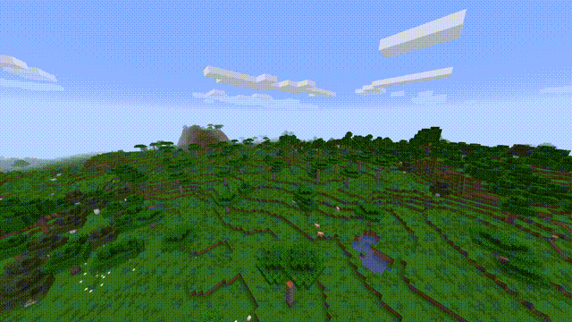
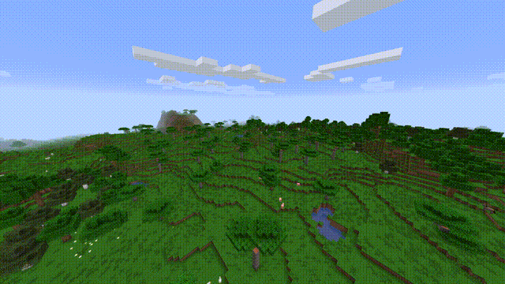
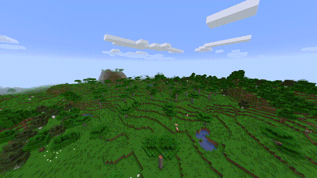
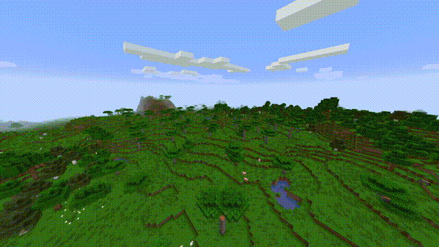

  

<h1 align="center">Smooth Chunks</h1>

Chunk loading in Minecraft can be very jagged when they appear out of nowhere. With this mod, you can configure a nice animation for how chunks load in to your world.

<h1 align="center">Abandoned ⚠️</h1>
I'm no longer maintaining this project. You can see why . A much better mod that does the same thing and more can be found . As a side note, be kind to developers and creators who do things for free :)

## Animations

### Upward

### Downward

### Inward

### Scale

## Incompatibilities

Unfortunately the mod is incompatible with Sodium and OptiFine/OptiFabric at this time. I'd like to add support for them eventually though. I also assume that the mod is incompatible with many other rendering focused mods such as Canvas, though I haven't tested it.
